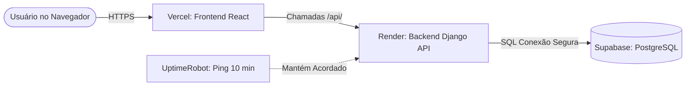

# Guia de Deploy 100% Gratuito — FreeCash

Este guia foi elaborado para quem deseja publicar o **FreeCash** na internet pela primeira vez, com **custo zero (R$ 0,00)**, alta segurança (HTTPS/SSL automático) e sem precisar gerenciar servidores Linux via terminal SSH.

---

## Arquitetura da Solução Gratuita



| Componente | Provedor | Plano | Função |
| :--- | :--- | :--- | :--- |
| **Frontend** | [Vercel](https://vercel.com) | Gratuito (*Hobby*) | Hospeda a interface React (Vite) com CDN global e SSL. |
| **Backend** | [Render](https://render.com) | Gratuito (*Free Web Service*) | Roda a API Django com Python/Gunicorn. |
| **Banco de Dados** | [Supabase](https://supabase.com) | Gratuito (*Free Tier*) | Banco PostgreSQL 16 gerenciado (500 MB). |
| **Despertador** | [UptimeRobot](https://uptimerobot.com) | Gratuito (*Free Plan*) | Faz pings a cada 10 min no `/api/health/` para evitar hibernação. |

---

## Pré-requisito

* Seu código deve estar em um repositório no seu GitHub (público ou privado).

---

## Etapa 1: Criar o Banco de Dados no Supabase (5 min)

1. Acesse **[supabase.com](https://supabase.com)** e crie uma conta gratuita.
2. Clique em **"New Project"** e selecione a organização.
3. Preencha:
   * **Name:** `freecash-db`
   * **Database Password:** Gere uma senha forte e **guarde-a** (você precisará dela no Render).
   * **Region:** Escolha `South America (São Paulo)` para menor latência (ou `East US`).
4. Clique em **"Create new project"** e aguarde cerca de 1 a 2 minutos até o banco inicializar.
5. Obtenha os dados de conexão:
   * No menu lateral, vá em **Project Settings** (ícone de engrenagem) > **Database**.
   * Role até a seção **Connection parameters**:
     * **Host:** algo como `db.xxxxxx.supabase.co`
     * **Database name:** `postgres`
     * **Port:** `5432` (ou `6543` se usar pooler de sessão)
     * **User:** `postgres`
     * **Password:** a senha que você definiu no passo 3.

---

## Etapa 2: Subir o Backend no Render.com (10 min)

1. Acesse **[render.com](https://render.com)** e crie sua conta (pode entrar direto com seu GitHub).
2. No painel inicial (*Dashboard*), clique em **New +** > **Web Service**.
3. Selecione a opção **"Build and deploy from a Git repository"** e conecte seu repositório do FreeCash.
4. Preencha as configurações principais:
   * **Name:** `freecash-api` (ou outro nome de sua preferência)
   * **Region:** A mesma ou a mais próxima do Supabase (ex: `Ohio (US East)` ou `Frankfurt`).
   * **Branch:** `main`
   * **Root Directory:** `backend` *(MUITO IMPORTANTE)*
   * **Runtime:** Selecione **Docker** (o Render usará seu `Dockerfile.backend`) ou **Python 3**.
     * *Se escolher Python:*
       * **Build Command:** `pip install -r requirements.txt && python manage.py collectstatic --noinput`
       * **Start Command:** `python manage.py migrate --noinput && python manage.py createcachetable && gunicorn freecash.wsgi:application --bind 0.0.0.0:$PORT`
   * **Instance Type:** Escolha **Free** ($0/month).

5. Role até **Environment Variables** (Variáveis de Ambiente) e adicione as seguintes chaves:

| Chave | Valor Recomendado |
| :--- | :--- |
| `DJANGO_DEBUG` | `False` |
| `DJANGO_SECRET_KEY` | *(Gere uma chave secreta longa e aleatória)* |
| `DJANGO_ALLOWED_HOSTS` | `.onrender.com` |
| `DB_NAME` | `postgres` |
| `DB_USER` | `postgres` |
| `DB_PASS` | *(A senha que você definiu no Supabase)* |
| `DB_HOST` | `db.xxxxxx.supabase.co` *(O host do Supabase)* |
| `DB_PORT` | `5432` |
| `DJANGO_SECURE_SSL_REDIRECT` | `True` |
| `DJANGO_AUTH_COOKIE_SECURE` | `True` |
| `DJANGO_CORS_ALLOWED_ORIGINS` | `http://localhost:5173` *(Atualizaremos com a Vercel na Etapa 3)* |
| `DJANGO_CSRF_TRUSTED_ORIGINS` | `https://*.onrender.com` |

6. Clique em **"Create Web Service"**.
7. O Render começará a compilar e aplicar as migrations no Supabase. Quando terminar, o status mudará para **"Live"** e você terá uma URL, por exemplo:
   `https://freecash-api.onrender.com`

8. **Criar seu Usuário Administrador:**
   * No menu do seu serviço no Render, clique na aba **"Shell"**.
   * Digite:
     ```bash
     python manage.py createsuperuser
     ```
   * Defina seu nome de usuário, e-mail e senha.

---

## Etapa 3: Subir o Frontend na Vercel (5 min)

1. Acesse **[vercel.com](https://vercel.com)** e crie sua conta (entre com o GitHub).
2. Clique em **"Add New..."** > **"Project"**.
3. Importe o repositório do **FreeCash**.
4. Configure o projeto:
   * **Framework Preset:** `Vite`
   * **Root Directory:** Clique em *Edit* e selecione a pasta **`frontend`** *(MUITO IMPORTANTE)*.
5. Abra a seção **Environment Variables** e adicione:
   * **Key:** `VITE_API_URL`
   * **Value:** A URL da sua API no Render (ex: `https://freecash-api.onrender.com` — **sem barra no final**).
6. Clique em **"Deploy"**.
7. Em menos de 1 minuto, sua aplicação estará no ar com uma URL como:
   `https://freecash-front.vercel.app`

### Ajuste Final de Segurança (CORS)
Agora que você tem o domínio do frontend na Vercel:
1. Volte ao painel do **Render** > seu serviço > **Environment**.
2. Atualize a variável `DJANGO_CORS_ALLOWED_ORIGINS` para incluir o seu domínio da Vercel:
   ```env
   DJANGO_CORS_ALLOWED_ORIGINS=https://freecash-front.vercel.app
   ```
3. Adicione também em `DJANGO_CSRF_TRUSTED_ORIGINS`:
   ```env
   DJANGO_CSRF_TRUSTED_ORIGINS=https://*.onrender.com,https://freecash-front.vercel.app
   ```
4. Salve as alterações (o Render reiniciará o serviço em segundos).

---

## Etapa 4: Evitar o Adormecimento com UptimeRobot (2 min)

Para garantir que o Render e o Supabase nunca durmam por inatividade:

1. Acesse **[uptimerobot.com](https://uptimerobot.com)** e crie uma conta gratuita.
2. No painel, clique em **"+ Add New Monitor"**.
3. Configure:
   * **Monitor Type:** `HTTP(s)`
   * **Friendly Name:** `FreeCash API Healthcheck`
   * **URL (or IP):** `https://freecash-api.onrender.com/api/health/`
   * **Monitoring Interval:** `10 minutes` (a cada 10 minutos)
4. Clique em **"Create Monitor"**.

Pronto! A cada 10 minutos, o UptimeRobot fará uma requisição leve ao endpoint de saúde, garantindo que sua API fique **sempre acordada e rápida**, sem nenhum custo.

---

## Checklist de Sucesso

- [ ] Acessar o link da Vercel (`https://sua-aplicacao.vercel.app`).
- [ ] Fazer login com o usuário criado no passo do `createsuperuser`.
- [ ] Navegar pelo Dashboard e cadastrar sua primeira transação ou cartão.
- [ ] Verificar que os dados persistem e os gráficos são carregados com sucesso.
