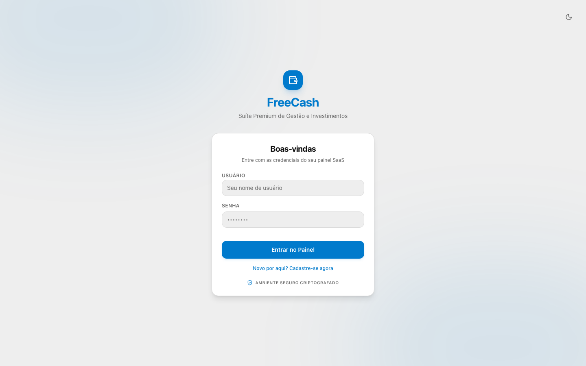
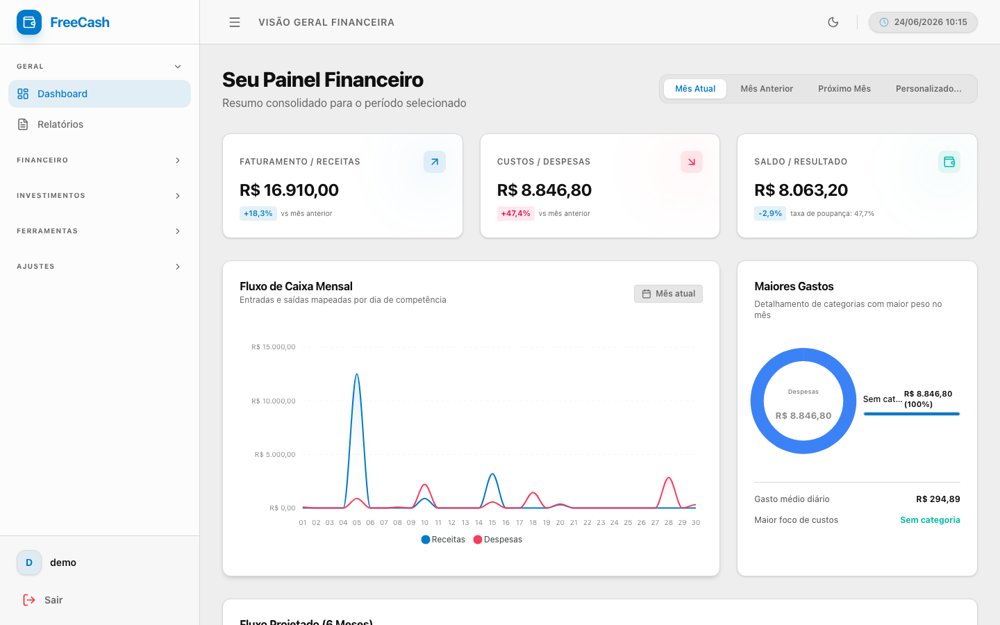
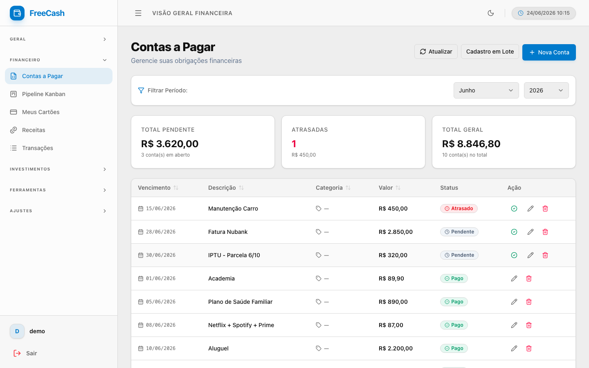
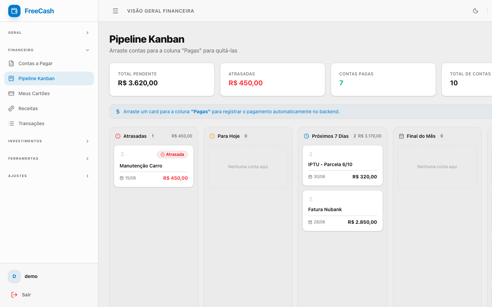
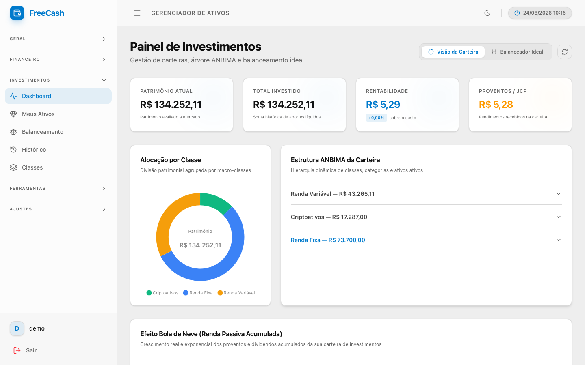
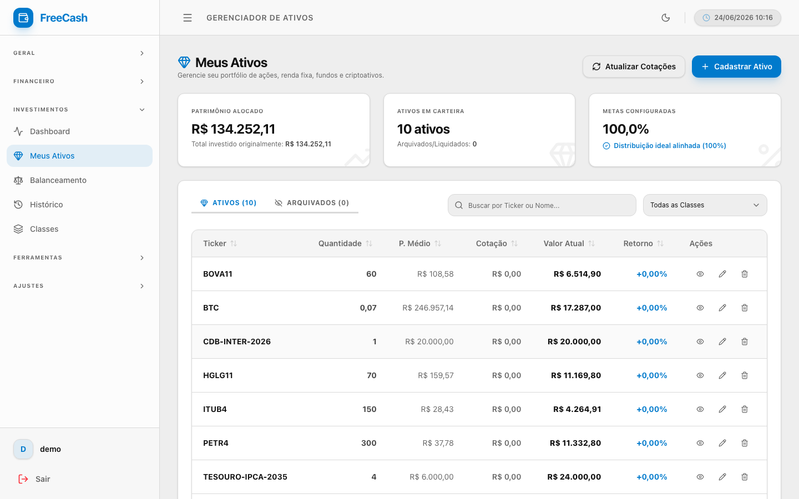
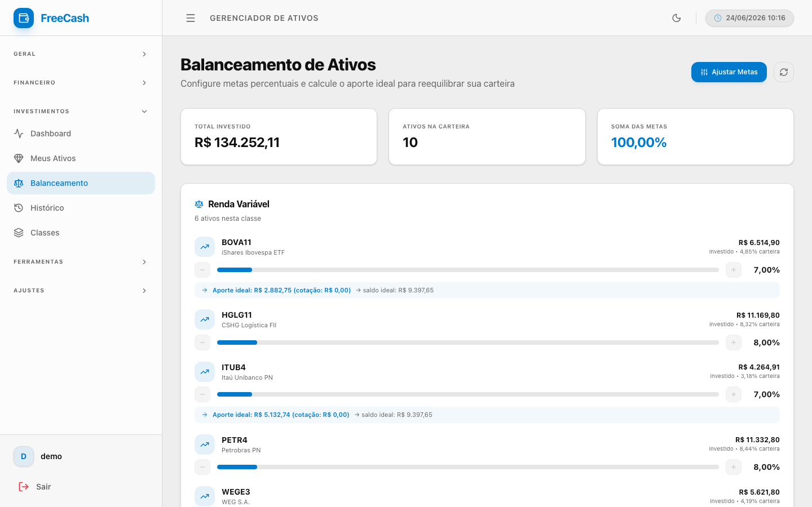
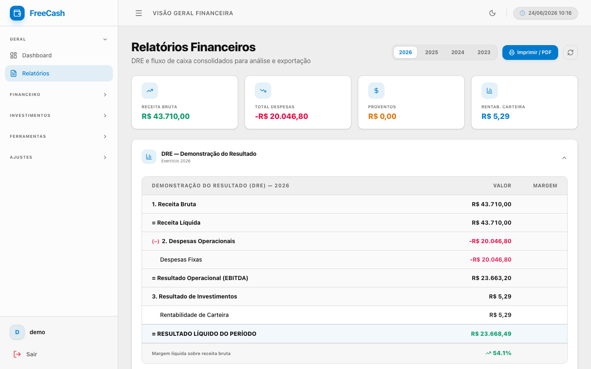

# FreeCash

**FreeCash** é uma suíte completa de gestão financeira pessoal e controle avançado de investimentos. A aplicação combina uma API robusta em **Django 6** com uma interface moderna e reativa em **React 19** e **Tailwind CSS v4**, entregando controle patrimonial de nível profissional direto no seu servidor.

Vai além do registro de entradas e saídas: integra carteira multi-ativos com hierarquia ANBIMA, cotações em tempo real, pipeline Kanban de contas, importação de extratos bancários, DRE mensal e backup criptografado — tudo num ecossistema isolado em containers Docker.

---

## Telas do Sistema

### Login e Dashboard Principal

| Tela de Login | Dashboard Financeiro |
|---|---|
|  |  |

> O dashboard consolida receitas, despesas e saldo do mês em tempo real, com gráfico de fluxo de caixa diário, breakdown de maiores gastos por categoria e projeção de 6 meses.

---

### Gestão Financeira

| Contas a Pagar | Pipeline Kanban |
|---|---|
|  |  |

> **Contas a Pagar** apresenta status visual inteligente (Atrasado, Pendente, Pago) com alertas de vencimento. O **Pipeline Kanban** permite arrastar contas entre colunas — ao mover para "Pagas", o pagamento é registrado automaticamente no backend.

---

### Carteira de Investimentos

| Dashboard de Investimentos | Meus Ativos |
|---|---|
|  |  |

> O painel de investimentos exibe patrimônio total, rentabilidade acumulada, alocação por classe em gráfico donut e a árvore hierárquica ANBIMA expansível. A tabela de ativos mostra ticker, quantidade, preço médio, cotação atual e retorno colorido.

---

### Balanceamento e Relatórios

| Balanceamento de Carteira | Relatórios Financeiros (DRE) |
|---|---|
|  |  |

> O **Balanceador** calcula o aporte ideal por ativo com sliders de meta percentual — indica exatamente quanto comprar para atingir a alocação alvo. Os **Relatórios** geram DRE completo com EBITDA, Resultado Líquido e margem líquida por ano.

---

## Funcionalidades

### Financeiro Pessoal (`core`)

**Dashboard de Fluxo de Caixa**
- KPIs: Receita Total, Despesas Totais, Saldo Líquido com variação vs. mês anterior
- Gráfico de área de fluxo diário (receitas x despesas)
- Breakdown de maiores categorias de gastos (donut chart)
- Projeção de fluxo de caixa para os próximos 6 meses
- Seletor de período: mês atual, anterior, próximo ou intervalo personalizado

**Contas a Pagar / Contas a Receber**
- CRUD completo com formulário validado (React Hook Form + Zod)
- Status inteligente: Atrasado, Pendente, Vence Hoje, Pago
- Ação de pagamento rápido com desfazer (undo)
- Cadastro em lote via tabela editável
- Filtros por mês/ano

**Pipeline Kanban**
- Quadro visual com 5 colunas: Atrasadas / Para Hoje / Próximos 7 Dias / Final do Mês / Pagas
- Drag-and-drop: arrastar para "Pagas" registra o pagamento via API automaticamente
- KPIs de total pendente, atrasado e pago no topo

**Receitas**
- Controle de receitas recorrentes e avulsas
- Status: Previsto, Recebido, Atrasado
- KPIs: Total Previsto, Total Recebido, A Receber

**Extrato de Transações**
- Listagem cronológica de todas as movimentações agrupadas por dia
- Busca por descrição, categoria ou valor

**Cartões de Crédito**
- Cadastro de cartões com limite, dia de fechamento, dia de vencimento e cor personalizada
- Gauge de utilização do limite por cartão
- Histórico de compras recentes por cartão
- Importação de faturas PDF (Nubank, Santander)

**Relatórios Financeiros**
- DRE (Demonstração do Resultado) anual com Receita Bruta, Despesas Operacionais, EBITDA e Resultado Líquido com margem
- Fluxo de caixa consolidado por ano
- Heatmap de sazonalidade de despesas (últimos 6 meses)
- Exportação para PDF via impressão do navegador

---

### Gestão de Investimentos (`investimento`)

**Dashboard de Investimentos**
- KPIs: Patrimônio Total, Total Investido, Rentabilidade Acumulada, Proventos Recebidos
- Gráfico de alocação patrimonial por classe de ativo (donut chart)
- Árvore ANBIMA expansível: Classe → Categoria → Subcategoria → Ativo
- Gráfico de Efeito Bola de Neve (renda passiva acumulada ao longo do tempo)
- Dois modos: Visão da Carteira e Balanceador Ideal

**Hierarquia ANBIMA de 3 Níveis**
- **Nível 1 — Classe:** Renda Fixa, Renda Variável, Multimercado, Cambial, Criptoativos
- **Nível 2 — Categoria:** Pós-fixado, IPCA, Pré-fixado, Ações, FIIs, ETFs, Moedas, Moedas Digitais
- **Nível 3 — Subcategoria:** Tesouro Selic, CDB/RDB, LCI/LCA, Ações Brasil, BDRs, FII de Tijolo, FII de Papel, Bitcoin, Ethereum, etc.
- Estrutura criada automaticamente para cada novo usuário via Django Signals

**Meus Ativos**
- Tabela com Ticker, Quantidade, Preço Médio, Cotação Atual, Valor Total e Retorno (% colorido)
- Busca e filtro por classe de ativo
- Atualização de cotações via Yahoo Finance (yfinance) com um clique
- CRUD completo: cadastro de ações, FIIs, ETFs, renda fixa (com indexador, taxa, vencimento) e criptoativos

**Detalhe do Ativo**
- 3 abas: Dados Gerais, Rentabilidade e Histórico de Transações
- Posição atual: quantidade, preço médio, cotação, valor e retorno
- Renda fixa: emissor, indexador (CDI, IPCA, SELIC, Pré), taxa e data de vencimento

**Balanceamento de Carteira**
- Sliders de meta percentual por ativo (botões +/−)
- Validador em tempo real: soma das metas deve ser exatamente 100%
- Cálculo do aporte ideal: quanto comprar de cada ativo para atingir a alocação alvo
- Scatter plot: rentabilidade vs. desvio da meta (Balanceador Ideal)

**Histórico de Transações**
- Ledger cronológico de todas as operações: Compra (C), Venda (V), Provento (D)
- Filtros por tipo de transação e busca por ticker
- CRUD: adicionar, editar e excluir transações com recálculo automático de preço médio

**Cálculo Automático de Posição**
- Django Signal `atualizar_ativo_apos_transacao` recalcula Preço Médio e Quantidade sempre que uma transação é criada, editada ou removida

---

### Ferramentas

**Importação de Extratos**
- Engine universal para extratos bancários (Nubank, Banco Inter, Itaú, Bradesco) em XLS/CSV
- Mapeamento automático de linhas para transações com conciliação

**Backup e Exportação**
- Formatos: Excel (.xlsx), CSV, PDF e `.fcbk` (backup proprietário)
- Backup `.fcbk` criptografado com AES-GCM e senha opcional
- Escopo por data ou exportação completa

**Importação de Backup**
- Drag-and-drop de arquivo `.fcbk` com suporte a senha
- Relatório de importação: registros criados e atualizados por categoria

**Ajustes de Pagamentos**
- Cadastro e gerenciamento de cartões de crédito e contas bancárias
- Toggle ativo/inativo por cartão
- Paleta de cores e ícones personalizáveis (Nubank, Inter, Itaú, Bradesco...)

---

## Tech Stack

### Backend
| Tecnologia | Uso |
|---|---|
| Python 3.12 + Django 6 | Core da API |
| Django REST Framework | Endpoints RESTful |
| PostgreSQL 16 + psycopg3 | Banco de dados |
| djangorestframework-simplejwt | Autenticação JWT via cookies HttpOnly |
| yfinance | Cotações de mercado (Yahoo Finance) |
| pandas + openpyxl | Importação/exportação de planilhas |
| pdfplumber + reportlab | Leitura e geração de PDFs |
| whitenoise | Servir arquivos estáticos |

### Frontend
| Tecnologia | Uso |
|---|---|
| React 19 + Vite 6 | SPA com HMR |
| Tailwind CSS v4 | Estilização nativa baseada em CSS |
| TanStack React Query | Cache e sincronização com a API |
| React Hook Form + Zod | Formulários com validação tipada |
| React Router Dom v7 | Roteamento SPA |
| ApexCharts | Gráficos interativos |
| Lucide React | Ícones vetoriais |

### Infraestrutura
| Tecnologia | Uso |
|---|---|
| Docker + Docker Compose | Isolamento de serviços |
| `run.sh` / `run.py` | Orquestrador local com resolução dinâmica de portas |

---

## Como Rodar

### Opção A: Docker (Recomendado)

O orquestrador detecta conflitos de porta automaticamente e configura o ambiente.

```bash
# Método recomendado (zero dependências no host além do Docker)
chmod +x run.sh
./run.sh

# Ou com Python
python3 run.py
```

Acesso após subir:
- **Frontend:** http://localhost:5173
- **API:** http://localhost:8000/api/
- **PostgreSQL:** porta 5432 (ou remapeada automaticamente)

*Para encerrar, pressione `Ctrl+C`.*

### Opção B: Execução Manual

#### Backend

```bash
python3 -m venv .venv && source .venv/bin/activate

pip install -r backend/requirements.txt

cp .env_example .env
# Edite .env com suas credenciais do PostgreSQL

cd backend
python manage.py migrate
python manage.py createsuperuser
python manage.py runserver 127.0.0.1:8000
```

#### Frontend

```bash
cd frontend
npm install
npm run dev
```

Acesse http://localhost:5173. O cliente React conecta automaticamente ao backend em `localhost:8000`.

---

## Estrutura do Repositório

```
freecash/
├── backend/
│   ├── core/                   # Módulo financeiro (contas, cartões, extratos, dashboard)
│   │   ├── models.py           # Conta, CartaoCredito, Categoria, ExtratoImportado
│   │   ├── views/api.py        # Endpoints DRF + autenticação JWT
│   │   └── services/           # dashboard_helper, import_service
│   ├── investimento/           # Módulo de investimentos (ativos, ANBIMA, cotações)
│   │   ├── models.py           # Ativo, TransacaoInvestimento, ClasseAtivo, etc.
│   │   ├── signals.py          # Recálculo automático de preço médio
│   │   └── services/           # dashboard_service, calculators, yfinance sync
│   ├── freecash/               # Configurações globais Django (settings, urls)
│   └── requirements.txt
│
├── frontend/
│   └── src/
│       ├── pages/              # 20+ telas (Dashboard, Investimentos, Kanban, etc.)
│       ├── components/         # UI atômico (Button, Card, Modal, DataTable...)
│       ├── layouts/            # DashboardLayout com sidebar colapsável
│       ├── services/           # Axios + custom hooks React Query por domínio
│       └── App.jsx             # Roteamento + provedores globais
│
├── docs/screenshots/           # Screenshots do sistema
├── docker-compose.yml
├── Dockerfile.backend
├── Dockerfile.frontend
├── Dockerfile.postgres
├── run.sh                      # Orquestrador Bash (recomendado)
└── run.py                      # Orquestrador Python alternativo
```

---

## Arquitetura

O FreeCash segue arquitetura SPA desacoplada. O React envia requisições via Axios autenticadas com JWT (cookie HttpOnly); o Django processa via DRF e retorna JSON; o React Query mantém o cache local sincronizado.

```
React 19 (Vite)          HTTP REST / JWT Bearer        Django 6 (DRF)
  TanStack Query    ──────────────────────────────►   Views + Serializers
  ApexCharts        ◄──────────────────────────────   ORM psycopg3
  Zod / RHF                                               │
                                                    PostgreSQL 16
```

**Django Signals** garantem integridade dos dados de investimentos sem lógica no cliente:
- `criar_classificacao_padrao` — popula a árvore ANBIMA completa no cadastro de cada novo usuário
- `atualizar_ativo_apos_transacao` — recalcula Preço Médio e Quantidade acumulada a cada operação

---

## Pré-requisitos

- **Docker** com suporte a `docker compose` (para o método recomendado)
- **Python 3.12+** (para execução manual do backend)
- **Node.js 20+** e **npm** (para desenvolvimento do frontend)

---

## Testes

```bash
# Via Docker
docker compose exec backend python manage.py test

# Local
cd backend && python manage.py test

# Suite específica
python manage.py test investimento.tests
```

---

## Troubleshooting

**Porta já em uso (`Port already in use`)**
Nunca inicie com `docker compose up` diretamente. Use sempre `./run.sh` — ele detecta portas ocupadas e remapeia os containers automaticamente.

**Migrações pendentes (`Relation does not exist`)**
```bash
python manage.py migrate
```

**Frontend em loading infinito (CORS / Network Error)**
Confirme que o backend está ativo e que `VITE_API_URL` aponta para a porta correta. O orquestrador `./run.sh` faz isso automaticamente gerando o `.env.docker`.
