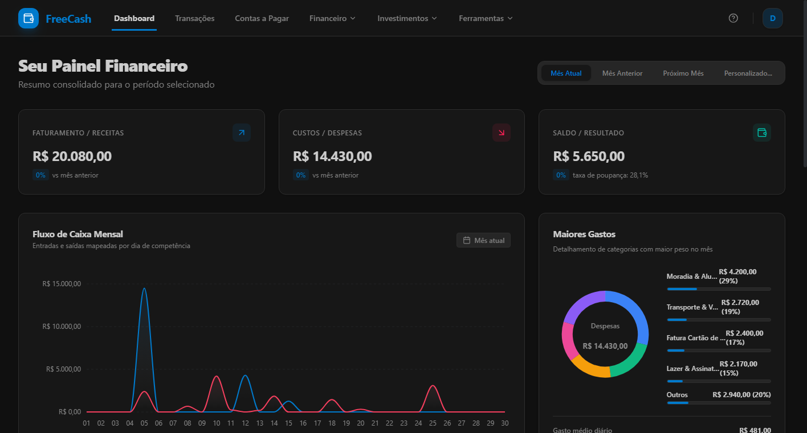
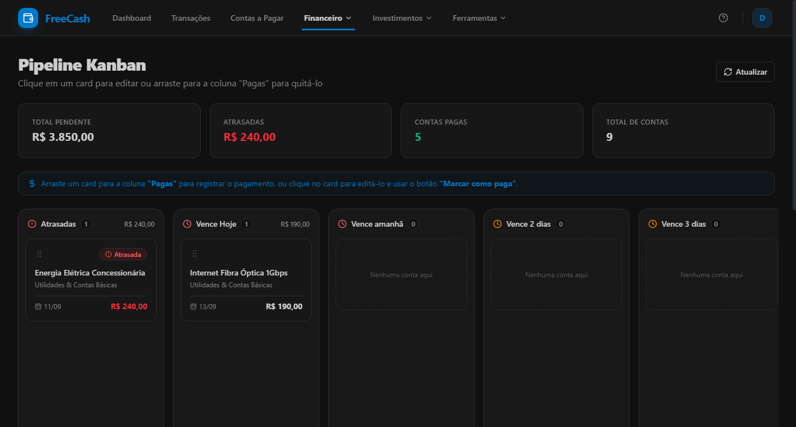
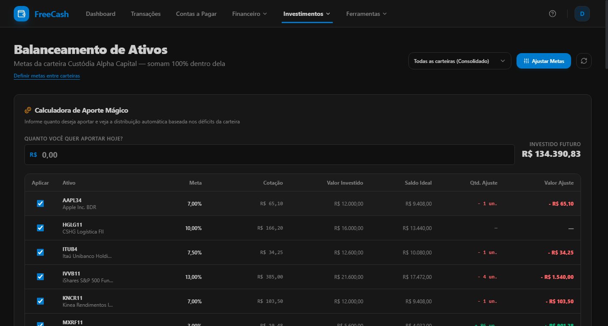
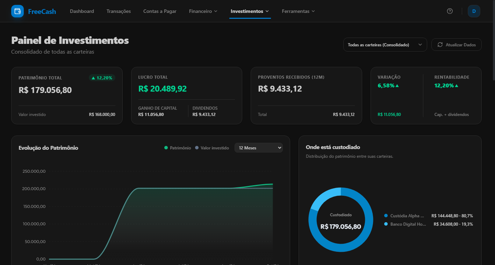
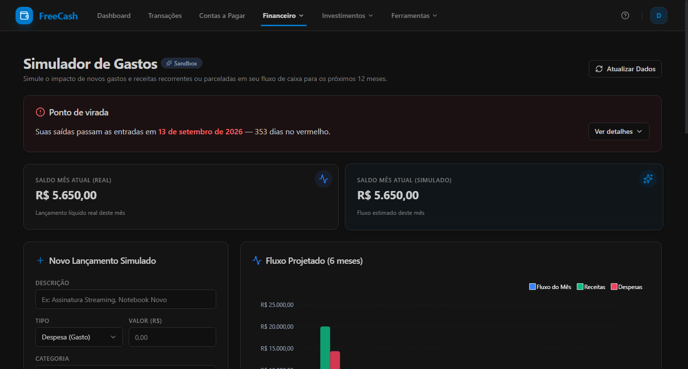
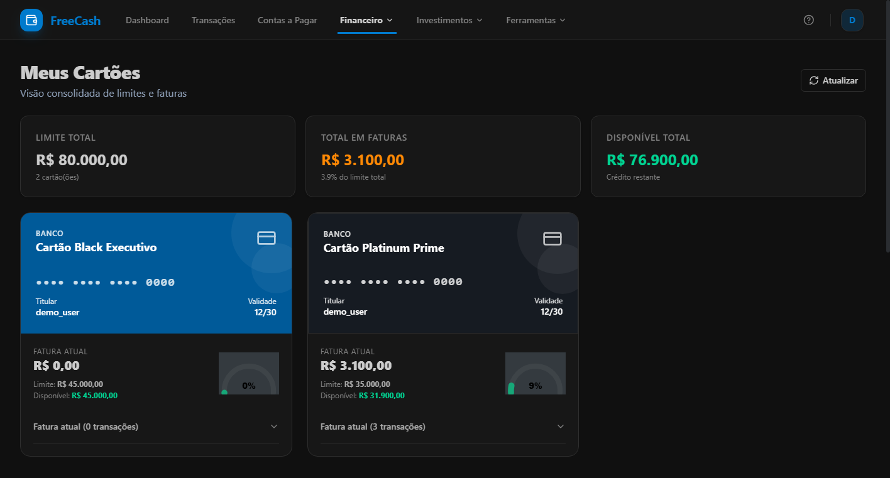

# FreeCash — Gestão Financeira & Controle Patrimonial

[](https://www.python.org/)
[](https://www.djangoproject.com/)
[](https://react.dev/)
[](https://tailwindcss.com/)
[](https://www.postgresql.org/)
[](https://www.docker.com/)

O **FreeCash** é uma plataforma corporativa de gestão financeira pessoal e governança patrimonial multi-ativos. Projetada sob uma arquitetura de serviços desacoplada (**Django REST Framework** + **React 19**), a aplicação integra controle de liquidez diária, auditoria de despesas, carteiras de investimentos estruturadas sob a taxonomia **ANBIMA em 3 níveis**, simulação preditiva de cenários e rotinas de conciliação bancária automatizada.

---

## Sumário

- [Visão Geral & Interfaces](#-visão-geral--interfaces)
- [Módulos da Plataforma](#-módulos-da-plataforma)
- [Arquitetura & Tecnologias](#-arquitetura--tecnologias)
- [Inicialização Rápida](#-inicialização-rápida)
- [Estrutura do Repositório](#-estrutura-do-repositório)
- [Qualidade e Testes](#-qualidade-e-testes)
- [Documentação Técnica de Domínio](#-documentação-técnica-de-domínio)

---

## 📸 Visão Geral & Interfaces

### 1. Gestão de Caixa & Operações Diárias

| Dashboard Financeiro Consolidado | Pipeline Kanban de Liquidação |
|:---:|:---:|
|  |  |

> **Dashboard:** Monitoramento de receitas, despesas, margem de poupança e curva diária de fluxo de caixa.<br>
> **Pipeline Kanban:** Acompanhamento visual de vencimentos com baixa contábil automatizada por drag-and-drop.

### 2. Governança de Carteira & Rebalanceamento

| Alocação & Aporte Ideal | Painel de Ativos & Rentabilidade |
|:---:|:---:|
|  |  |

> **Balanceador:** Algoritmo que calcula a distribuição ideal de novos aportes para cumprimento de metas sem giro desnecessário de carteira.<br>
> **Painel de Investimentos:** Visão consolidada por instituição/corretora, classes ANBIMA, preço médio fiscal e proventos acumulados.

### 3. Inteligência Preditiva & Gestão de Crédito

| Simulador de Gastos Sandbox (12 Meses) | Gestão de Cartões de Crédito |
|:---:|:---:|
|  |  |

> **Simulador de Gastos:** Projeção client-side em sandbox para testes de estresse financeiro e identificação de déficits futuros.<br>
> **Cartões:** Acompanhamento de comprometimento de limite, fechamento/vencimento e previsibilidade de parcelamentos.

---

## 💼 Módulos da Plataforma

### 1. Gestão Financeira & Fluxo de Caixa (`core`)
- **Contas a Pagar e Receber:** Ciclo completo de liquidação, controle de recorrências (mensal, quinzenal, anual) e cadastro em lote.
- **Pipeline Kanban:** Interface ágil com status por prazo (*Atrasadas*, *Para Hoje*, *Próximos 7 Dias*, *Final do Mês*, *Pagas*).
- **DRE Gerencial:** Demonstrativo de Resultado anual com EBITDA, despesas operacionais e margem líquida.
- **Extrato & Conciliação:** Agrupamento diário de movimentações financeiras com filtros avançados.

### 2. Gestão de Investimentos (`investimento`)
- **Taxonomia ANBIMA (3 Níveis):** Estrutura hierárquica completa (*Classe → Categoria → Subcategoria → Ativo*).
- **Múltiplas Custódias:** Segregação de posições por corretora/banco sem duplicar ativos nem distorcer o preço médio consolidado.
- **Precificação em Tempo Real:** Atualização automática de cotações via TradingView, CVM e Yahoo Finance sem dependências externas instáveis.
- **Rebalanceamento Inteligente:** Algoritmo de aporte eficiente para convergência de metas percentuais.
- **Histórico Contábil (Ledger):** Registro cronológico de compras, vendas, bonificações, proventos e transferências de custódia.

### 3. Inteligência Preditiva & Planejamento
- **Horizonte de Saldos:** Grade projetada dia a dia para 12 meses com alerta de saldo negativo e integração com reservas disponíveis.
- **Simulador Sandbox:** Ambiente isolado em memória para simulação de novos compromissos antes da tomada de decisão.
- **Gestão de Cartões:** Controle individual de limites, faturas em aberto e cronograma de parcelas futuras.

### 4. Segurança, Autenticação & Governança
- **Autenticação Segura:** JWT com cookies `HttpOnly`, política de senhas espelhada no cliente e encerramento de sessões ativas.
- **Proteção de Inatividade:** Monitor de ociosidade com modal preventivo e desconexão automática.
- **Painel Administrativo:** Gestão de usuários, suspensão auditada de acessos e métricas agregadas da plataforma.
- **Importação & Exportação:** Processamento de extratos bancários (XLS/CSV), faturas em PDF (`pdfplumber`) e backup criptografado AES-GCM (`.fcbk`).

---

## 🏗️ Arquitetura & Tecnologias

A solução adota uma arquitetura desacoplada com separação estrita de responsabilidades entre cliente e servidor:

```text
┌───────────────────────────────┐           HTTP/REST / JWT HttpOnly          ┌───────────────────────────────┐
│        Frontend (SPA)         │ ──────────────────────────────────────────► │         Backend (API)         │
│  React 19 • Vite • Tailwind   │                                             │   Django 6 • DRF • psycopg3   │
│  TanStack Query • ApexCharts  │ ◄────────────────────────────────────────── │  Signals • Services • Guards  │
└───────────────────────────────┘                                             └───────────────┬───────────────┘
                                                                                              │
                                                                              ┌───────────────┴───────────────┐
                                                                              │      PostgreSQL 16 Engine     │
                                                                              └───────────────────────────────┘
```

| Camada | Tecnologias |
|---|---|
| **Backend** | Python 3.12, Django 6.0, Django REST Framework, SimpleJWT, Gunicorn, psycopg3 |
| **Frontend** | React 19, Vite 6, Tailwind CSS v4, TanStack Query, React Hook Form, Zod, ApexCharts |
| **Banco de Dados** | PostgreSQL 16 com indexação transacional e integridade relacional |
| **Infraestrutura** | Docker, Docker Compose, Nginx (produção), WhiteNoise |

---

## 🚀 Inicialização Rápida

### Pré-requisitos
- [Docker](https://www.docker.com/) e [Docker Compose](https://docs.docker.com/compose/) instalados no host.

### Executando com Docker

```bash
# 1. Clone o repositório
git clone https://github.com/ChrystiandaHora/freecash.git
cd freecash

# 2. Configure as variáveis de ambiente
cp .env_example .env

# 3. Suba os containers com build automático
docker compose up -d --build
```

**Pontos de Acesso:**
- **Aplicação Web:** `http://localhost:5173`
- **API REST & Admin:** `http://localhost:8000/api/`
- **Banco de Dados:** `localhost:5432`

---

## 📁 Estrutura do Repositório

```text
freecash/
├── backend/
│   ├── core/                  # Domínio financeiro: transações, contas, cartões e orçamentos
│   ├── investimento/          # Domínio patrimonial: ativos, carteiras, ANBIMA e cotações
│   ├── freecash/              # Configurações globais, autenticação e rotas centrais
│   └── create_dummy_data.py   # Seeder de dados com métricas e cenários realistas
├── frontend/
│   ├── public/screenshots/    # Imagens do sistema utilizadas no README e na Landing Page
│   └── src/
│       ├── pages/             # Telas da aplicação (Dashboard, Investimentos, Landing, etc.)
│       ├── components/        # Design system e componentes reutilizáveis
│       └── services/          # Camada de comunicação com a API e cache React Query
├── docs/                      # Especificações técnicas e decisões de arquitetura por domínio
├── docker-compose.yml         # Orquestração para ambiente de desenvolvimento
└── DEPLOY.md                  # Guia de implantação em produção (VPS / HTTPS)
```

---

## 🧪 Qualidade e Testes

A suíte de testes automatizados cobre fluxos críticos de integridade contábil, isolamento de inquilinos (*multi-tenancy*) e cálculo financeiro:

```bash
# Executar suíte completa de testes no backend (PostgreSQL)
docker compose exec backend python manage.py test

# Executar testes específicos do módulo de investimentos
docker compose exec backend python manage.py test investimento.tests

# Executar suíte de testes do frontend (Vitest)
docker compose exec frontend npm run test
```

---

## 📚 Documentação Técnica de Domínio

Para aprofundamento nas decisões de design e regras contábeis implementadas, consulte os documentos de arquitetura em `docs/`:

| Documento | Foco Técnico |
|---|---|
| [docs/contas.md](docs/contas.md) | Regras de lançamentos contábeis, conciliação e recorrências |
| [docs/carteiras.md](docs/carteiras.md) | Segregação de custódia e isolamento de rentabilidade por corretora |
| [docs/cotacoes-e-preco-medio.md](docs/cotacoes-e-preco-medio.md) | Metodologia fiscal de Preço Médio e rotinas de cotação |
| [docs/fatura-cartao.md](docs/fatura-cartao.md) | Ciclo de vida e consolidação de faturas de cartão de crédito |
| [docs/importacao-extrato.md](docs/importacao-extrato.md) | Algoritmos de parsing para extratos bancários e faturas em PDF |
| [docs/autenticacao.md](docs/autenticacao.md) | Gestão de identidade, controle de sessões e segurança de acesso |
| [docs/backup.md](docs/backup.md) | Especificação do formato `.fcbk` e criptografia AES-GCM |
| [DEPLOY.md](DEPLOY.md) | Manual completo de implantação e infraestrutura para produção |
| [DEPLOY_GRATUITO.md](DEPLOY_GRATUITO.md) | Guia alternativo para publicação em tiers gratuitos |

---

## 📄 Licença

Este projeto é distribuído sob a licença MIT. Consulte o arquivo `LICENSE` para mais detalhes.
