# FreeCash

**FreeCash** é uma suíte completa de gestão financeira pessoal e controle avançado de investimentos. A aplicação combina uma API robusta em **Django 6** com uma interface moderna e reativa em **React 19** e **Tailwind CSS v4**, entregando controle patrimonial de nível profissional direto no seu servidor.

Vai além do registro de entradas e saídas: integra carteira multi-ativos com hierarquia ANBIMA de 3 níveis, cotações em tempo real, pipeline Kanban de contas, importação de extratos bancários e faturas em PDF, simulador de cenários de gastos, DRE mensal/anual e backup criptografado — tudo num ecossistema isolado em containers Docker.

---

## Telas do Sistema

### 1. Login e Dashboard Principal

| Tela de Login | Dashboard Financeiro |
|---|---|
| 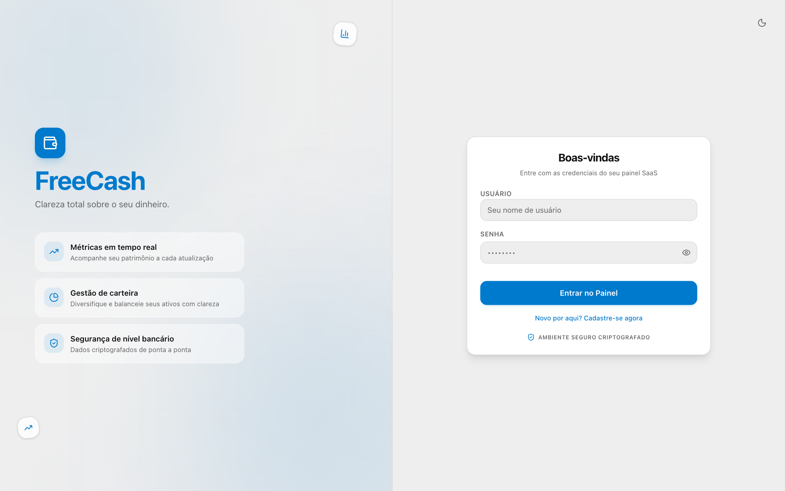 | 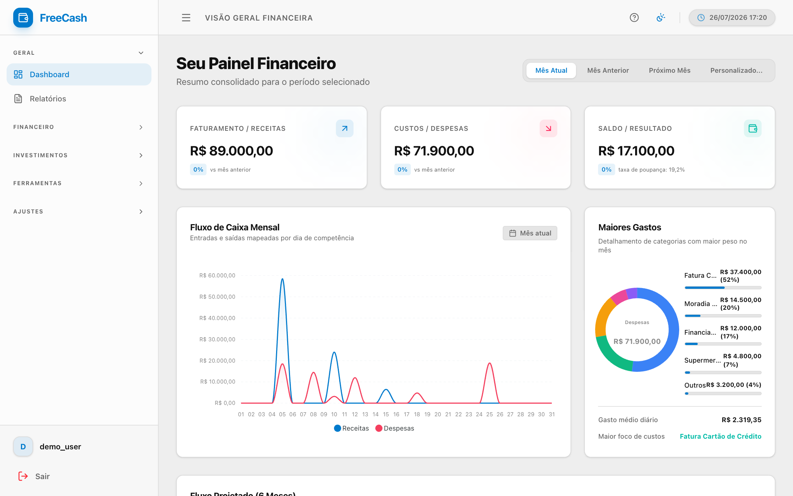 |

> A **Tela de Login** garante acesso seguro via autenticação JWT HttpOnly. O **Dashboard Financeiro** consolida receitas, despesas e saldo do mês em tempo real, com gráfico de fluxo de caixa diário, breakdown de maiores gastos por categoria e projeção de 6 meses.

---

### 2. Gestão de Contas a Pagar e Pipeline Kanban

| Contas a Pagar | Pipeline Kanban |
|---|---|
| 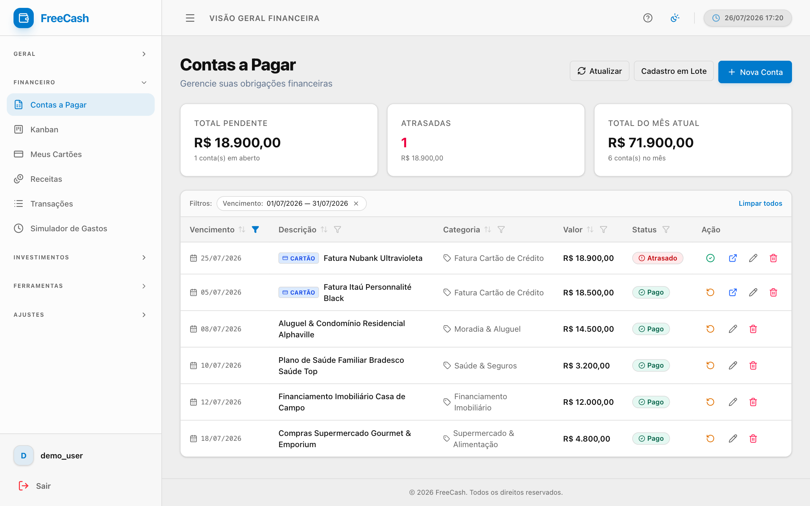 | 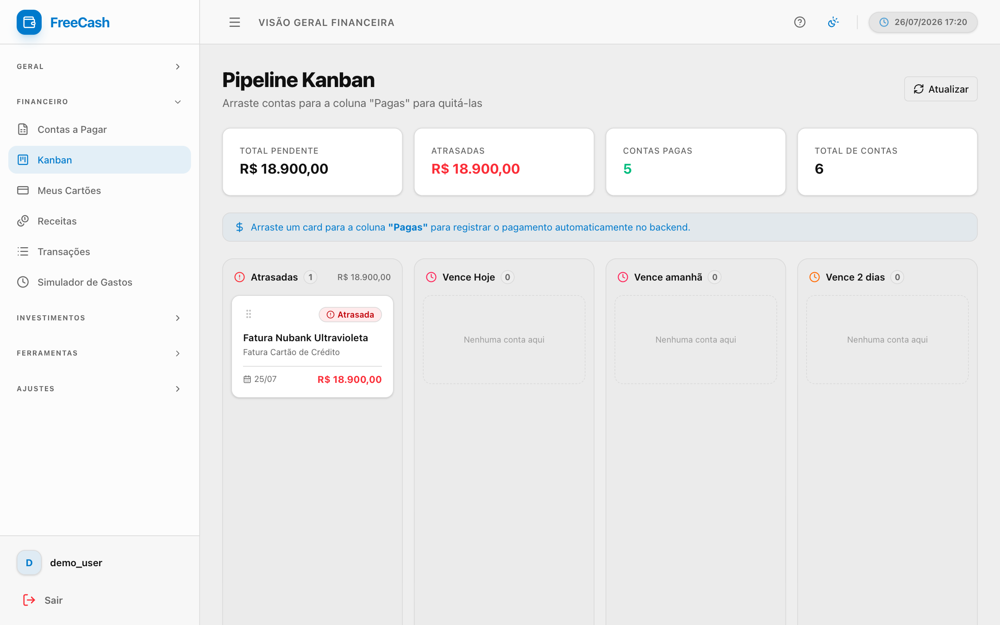 |

> A tela de **Contas a Pagar** apresenta status visual inteligente (Atrasado, Pendente, Vence Hoje, Pago) com liquidação rápida e cadastro em lote. O **Pipeline Kanban** permite arrastar contas entre colunas — ao mover para "Pagas", o pagamento é registrado automaticamente no backend.

---

### 3. Receitas e Extrato de Transações

| Gestão de Receitas | Extrato de Transações |
|---|---|
| 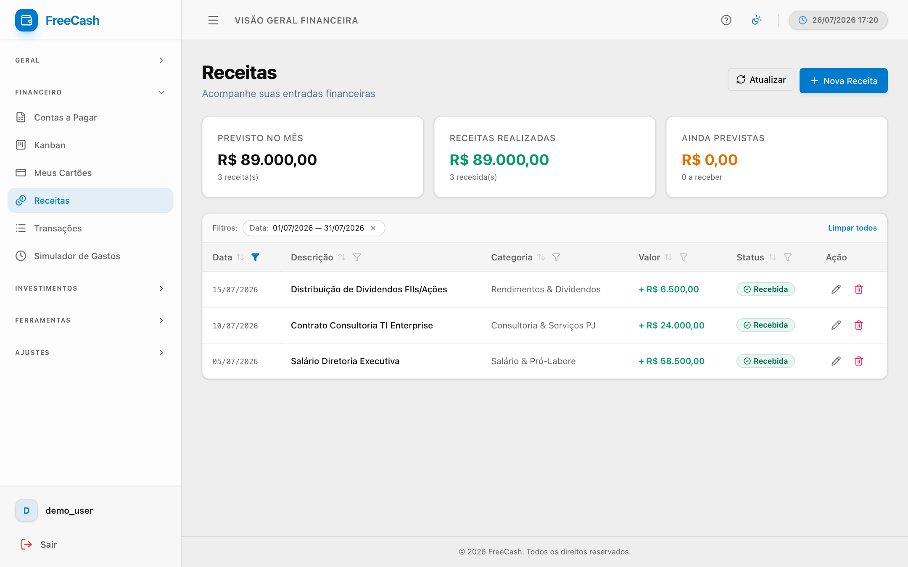 | 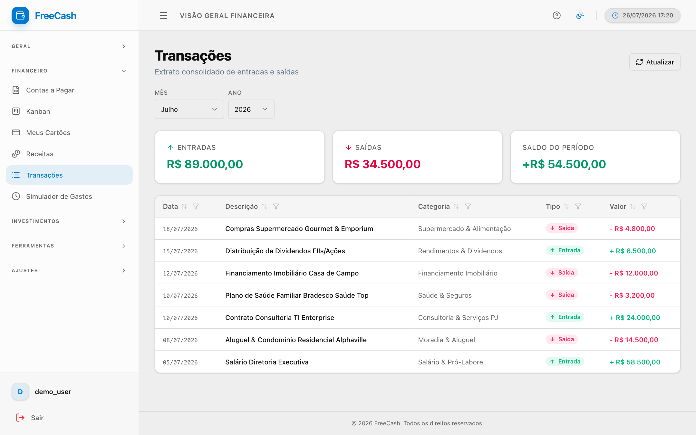 |

> O módulo de **Receitas** oferece controle de entradas recorrentes e avulsas com KPIs de total previsto vs. recebido. O **Extrato de Transações** apresenta a linha do tempo cronológica unificada de todas as movimentações financeiras com busca global e filtros por categoria.

---

### 4. Meus Cartões de Crédito e Simulador de Gastos

| Meus Cartões de Crédito | Simulador de Gastos |
|---|---|
| 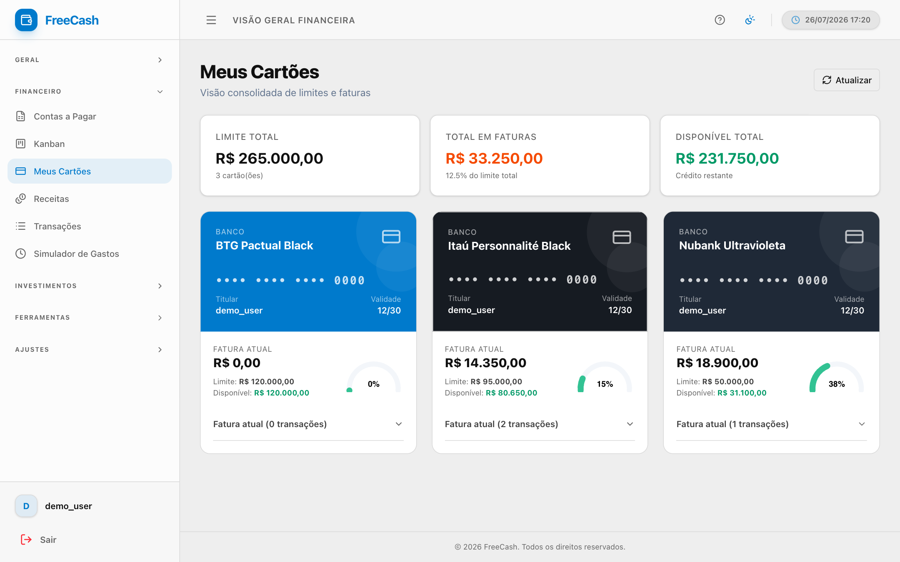 | 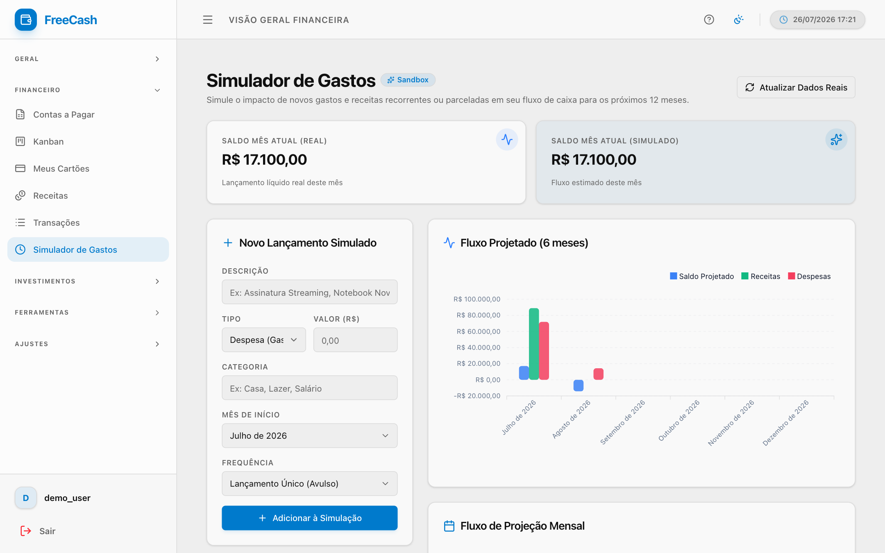 |

> A página **Meus Cartões** traz gauges de utilização do limite, datas de fechamento/vencimento e histórico de compras. O **Simulador de Gastos** permite simular cenários financeiros em até 12 meses, cruzando projeções temporárias client-side com dados reais do sistema.

---

### 5. Carteira de Investimentos e Meus Ativos

| Dashboard de Investimentos | Meus Ativos |
|---|---|
| 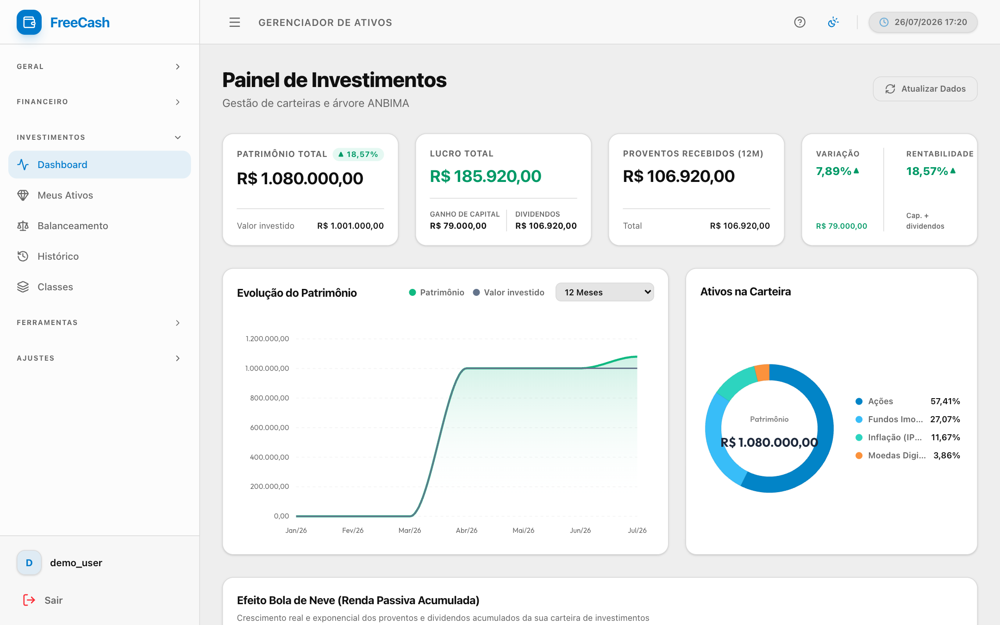 | 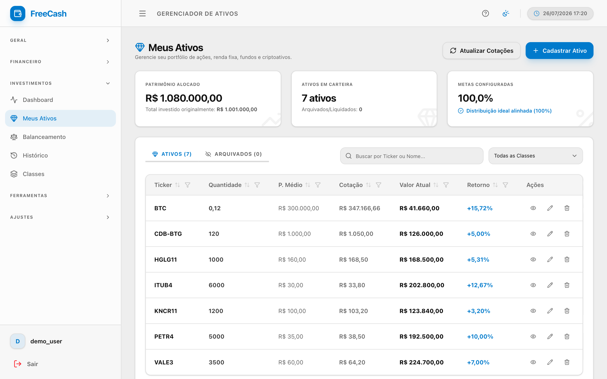 |

> O **Dashboard de Investimentos** exibe patrimônio total, rentabilidade acumulada, alocação por classe em gráfico donut e o gráfico de Efeito Bola de Neve (proventos). A tabela de **Meus Ativos** exibe tickers, quantidade, preço médio, cotação via Yahoo Finance e retorno colorido.

---

### 6. Balanceamento de Carteira e Histórico de Operações

| Balanceamento de Carteira | Histórico de Investimentos |
|---|---|
| 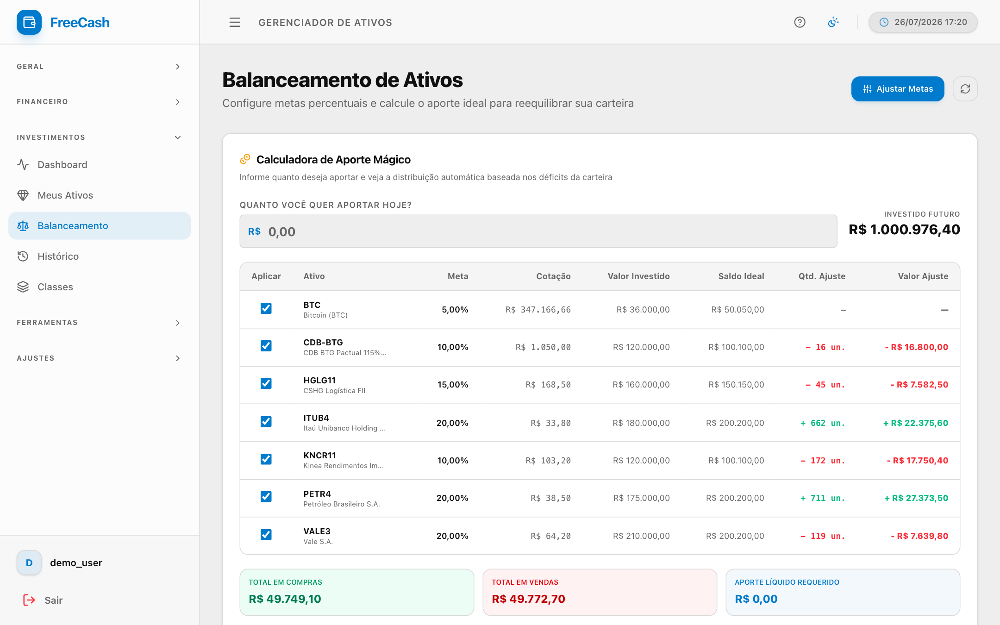 | 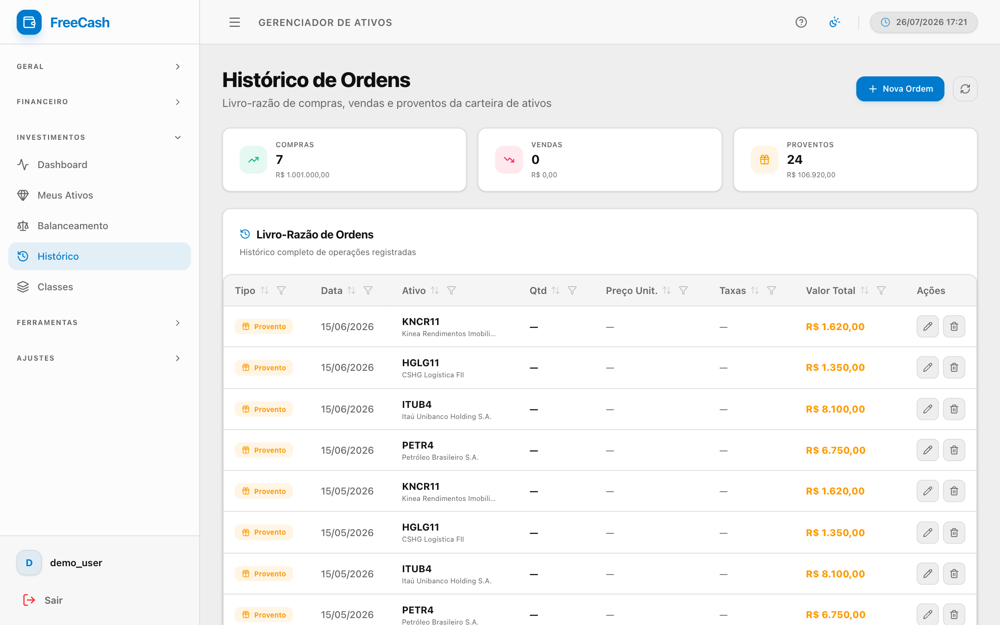 |

> O **Balanceamento de Carteira** calcula o aporte ideal por ativo com sliders de meta percentual em tempo real (soma 100%), indicando quanto comprar para atingir a alocação alvo. O **Histórico de Operações** mantém o ledger de compras, vendas e proventos com recálculo automático de preço médio via Django Signals.

---

### 7. Hierarquia ANBIMA e Relatórios DRE

| Hierarquia & Classes ANBIMA | Relatórios Financeiros (DRE) |
|---|---|
| 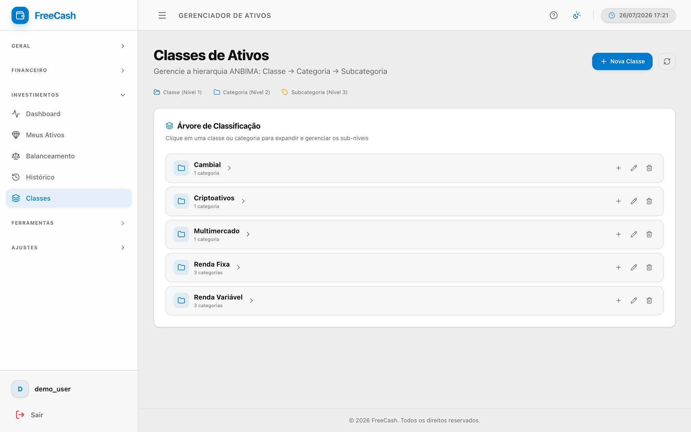 | 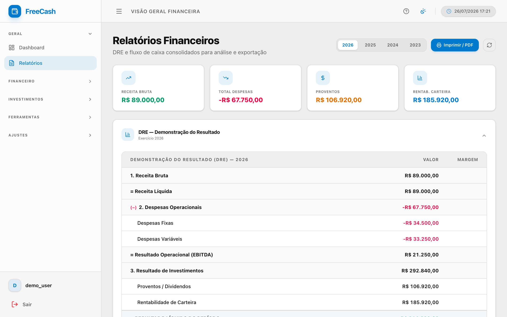 |

> O gerenciador de **Classes de Ativos** disponibiliza uma árvore expansível de 3 níveis (Classe → Categoria → Subcategoria) com CRUD completo para customizar a estrutura ANBIMA. A página de **Relatórios** constrói o DRE anual com EBITDA, Resultado Líquido e exportação para PDF.

---

### 8. Compras no Cartão e Ajustes de Pagamentos

| Compras no Cartão | Ajustes de Pagamentos |
|---|---|
| 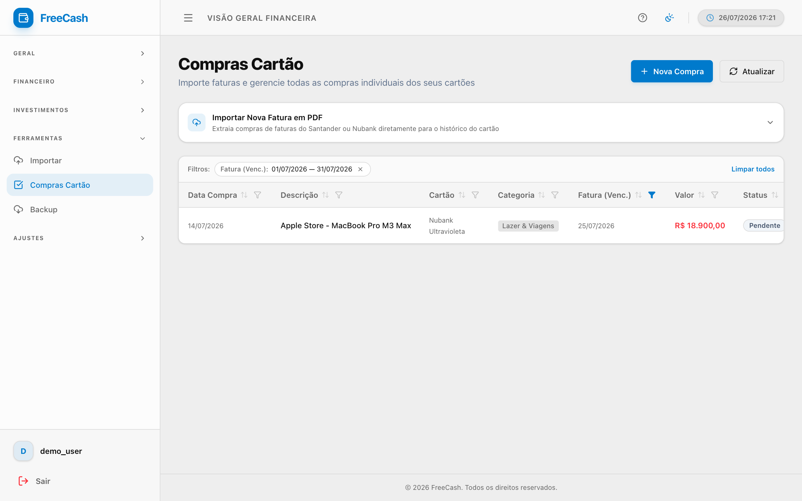 | 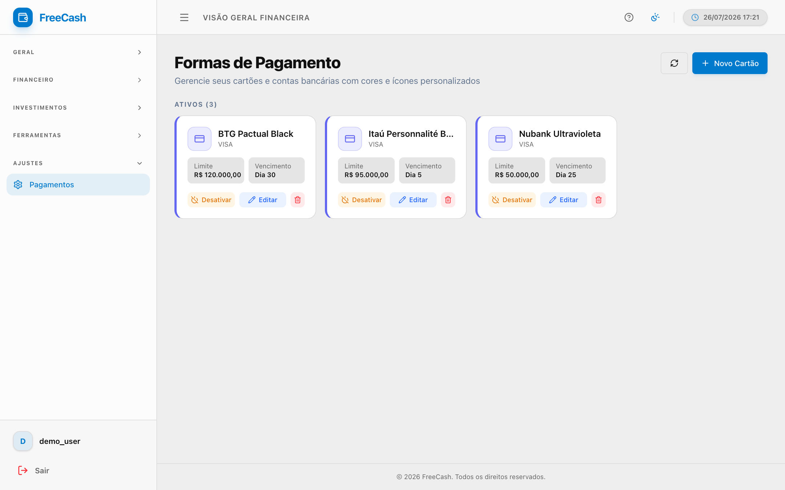 |

> **Compras no Cartão** gerencia a importação e conciliação de faturas PDF (Nubank, Santander) e controle de parcelamentos. **Ajustes de Pagamentos** permite cadastrar e configurar contas bancárias e cartões de crédito com presets de cores de bancos brasileiros e ícones personalizados.

---

## Funcionalidades

### Financeiro Pessoal (`core`)

**Dashboard de Fluxo de Caixa**
- KPIs: Receita Total, Despesas Totais, Saldo Líquido com variação vs. mês anterior
- Gráfico de área de fluxo diário (receitas x despesas)
- Breakdown de maiores categorias de gastos (donut chart)
- Projeção de fluxo de caixa para os próximos 6 meses
- Seletor de período: mês atual, anterior, próximo ou intervalo personalizado

**Contas a Pagar / Contas a Receber**
- CRUD completo com formulário validado (React Hook Form + Zod)
- Status inteligente: Atrasado, Pendente, Vence Hoje, Pago
- Ação de pagamento rápido com desfazer (undo)
- Cadastro em lote via tabela editável (`/contas-pagar/lote`)
- Filtros por mês/ano e busca por favorecido ou categoria

**Pipeline Kanban**
- Quadro visual com 5 colunas: Atrasadas / Para Hoje / Próximos 7 Dias / Final do Mês / Pagas
- Drag-and-drop: arrastar para "Pagas" registra o pagamento via API automaticamente
- KPIs de total pendente, atrasado e pago no topo

**Receitas**
- Controle de receitas recorrentes e avulsas
- Status: Previsto, Recebido, Atrasado
- KPIs: Total Previsto, Total Recebido, A Receber

**Extrato de Transações**
- Listagem cronológica de todas as movimentações agrupadas por dia
- Busca por descrição, categoria ou valor
- Ordenação por múltiplos critérios nas colunas

**Cartões de Crédito**
- Cadastro de cartões com limite, dia de fechamento, dia de vencimento e cor personalizada
- Gauge de utilização do limite por cartão
- Histórico de compras recentes por cartão

**Simulador de Gastos e Projeção Financeira**
- Simulação de cenários financeiros temporários client-side (em memória) para 12 meses
- Adição dinâmica de receitas e despesas hipotéticas (avulsas ou recorrentes)
- Cruzamento de dados simulados com contas e receitas reais cadastradas no banco
- Gráficos ApexCharts de linha do tempo e saldo mensal projetado

**Relatórios Financeiros**
- DRE (Demonstração do Resultado) anual com Receita Bruta, Despesas Operacionais, EBITDA e Resultado Líquido com margem
- Fluxo de caixa consolidado por ano
- Heatmap de sazonalidade de despesas (últimos 6 meses)
- Exportação para PDF via impressão otimizada do navegador

---

### Gestão de Investimentos (`investimento`)

**Dashboard de Investimentos**
- KPIs: Patrimônio Total, Total Investido, Rentabilidade Acumulada, Proventos Recebidos
- Gráfico de alocação patrimonial por classe de ativo (donut chart)
- Árvore ANBIMA expansível: Classe → Categoria → Subcategoria → Ativo
- Gráfico de Efeito Bola de Neve (renda passiva acumulada ao longo do tempo)
- Dois modos: Visão da Carteira e Balanceador Ideal

**Hierarquia ANBIMA de 3 Níveis**
- **Nível 1 — Classe:** Renda Fixa, Renda Variável, Multimercado, Cambial, Criptoativos
- **Nível 2 — Categoria:** Pós-fixado, IPCA, Pré-fixado, Ações, FIIs, ETFs, Moedas, Moedas Digitais
- **Nível 3 — Subcategoria:** Tesouro Selic, CDB/RDB, LCI/LCA, Ações Brasil, BDRs, FII de Tijolo, FII de Papel, Bitcoin, Ethereum, etc.
- Gerenciador visual interativo de classes (`/investimentos/classes`) com suporte a criação, edição e remoção de categorias e subcategorias
- Estrutura inicial populada automaticamente via Django Signals

**Carteiras por corretora** (`/investimentos/carteiras`)
- Uma carteira para cada corretora ou banco onde você tem investimentos
- Filtro em todas as telas de investimento: uma custódia por vez, ou o consolidado
- Transferência entre carteiras que **não** mexe no preço médio — mudar de corretora não é realizar lucro
- Marcação de quais carteiras contam como dinheiro disponível no Horizonte de Saldos
- Arquivamento, que tira a carteira dos filtros sem apagar o histórico de ordens
- O ativo continua único: PETR4 na XP e no Inter é um papel só, com uma série de cotações e o preço médio consolidado que se declara no IR

Detalhes de arquitetura e limites conhecidos em [docs/carteiras.md](docs/carteiras.md).

**Meus Ativos & Detalhe de Posição**
- Tabela com Ticker, Quantidade, Preço Médio, Cotação Atual, Valor Total e Retorno (% colorido)
- Busca e filtro por classe de ativo
- Atualização de cotações com um clique: TradingView e CVM em lote (escopado aos seus ativos), ou Yahoo Finance por ativo, tudo via `urllib` — sem dependência de `yfinance`
- Tela de detalhamento do ativo (`/investimentos/ativos/:id`) com abas de Dados Gerais, Rentabilidade e Histórico de Transações

**Balanceamento de Carteira**
- Sliders de meta percentual por ativo (botões +/−), dentro da carteira em foco
- Validador em tempo real: soma das metas deve ser exatamente 100% na carteira
- Meta de peso por carteira, respondendo quanto aportar em cada corretora
- Cálculo do aporte ideal: quanto comprar de cada ativo para atingir a alocação alvo
- Scatter plot: rentabilidade vs. desvio da meta (Balanceador Ideal)

**Histórico de Transações (Ledger)**
- Ledger cronológico de todas as operações: Compra (C), Venda (V), Provento (D) e Transferência entre carteiras (TS/TE)
- Filtros por tipo de transação e busca por ticker
- CRUD: adicionar, editar e excluir transações com recálculo automático de preço médio

**Cálculo Automático de Posição**
- Django Signal `atualizar_ativo_apos_transacao` recalcula, a cada transação criada, editada ou removida, o preço médio consolidado do ativo **e** a posição em cada carteira

---

### Planejamento e Previsibilidade

**Horizonte de Saldos** (`/horizonte-saldos`)
- Saldo acumulado projetado dia a dia para os próximos 12 meses, em grade de dias x meses
- Parte do dinheiro real em caixa; contas vencidas e não pagas entram no saldo de abertura
- O botão "Considerar valor investido" soma apenas as carteiras marcadas como disponíveis — reserva de emergência conta, ações não
- Inclui as ocorrências futuras das regras de recorrência, de receita **e de despesa**
- Aviso destacado com o primeiro dia em que o saldo fica negativo
- Cenário alternativo que desconta o aporte mensal necessário para cumprir cada meta no prazo
- Clique numa célula abre os lançamentos daquele dia

**Calendário de Pagamentos** (`/calendario`)
- Grade mensal com o que vence e o que entra em cada dia, e quantos lançamentos seguem pendentes
- Liquidação direta pela célula do dia, para receitas e despesas
- Compras de cartão aparecem no dia, mas o total considera a fatura — o dinheiro sai uma vez só

**Despesas fixas**
- Regras de recorrência passaram a cobrir despesas, não só receitas (mensal, quinzenal, semanal, anual)
- Cadastradas pelo formulário de Contas a Pagar, marcando "É uma despesa fixa"


---

## Documentação de arquitetura

Os documentos abaixo registram **por que** cada domínio é como é — as decisões, os modos
de falha conhecidos e o que ficou deliberadamente de fora. Leia o do domínio antes de
mexer nele.

| Documento | Cobre |
|---|---|
| [docs/contas.md](docs/contas.md) | Lançamentos, previsto × realizado, recorrência |
| [docs/fatura-cartao.md](docs/fatura-cartao.md) | Consolidação de fatura e a invariante do filtro de cartão |
| [docs/ativos.md](docs/ativos.md) | Cadastro de ativo e a árvore ANBIMA |
| [docs/carteiras.md](docs/carteiras.md) | Custódia por corretora e posição por carteira |
| [docs/cotacoes-e-preco-medio.md](docs/cotacoes-e-preco-medio.md) | Preço médio fiscal e as três fontes de cotação |
| [docs/importacao-extrato.md](docs/importacao-extrato.md) | Leitura de PDF bancário e conciliação |
| [docs/backup.md](docs/backup.md) | Formato `.fcbk` e compatibilidade entre versões |
| [docs/autenticacao.md](docs/autenticacao.md) | Identidade, tokens e recuperação de acesso |

---

### Contas e Administração

**Contas de usuário**
- Cadastro com e-mail obrigatório e senha validada pelos `AUTH_PASSWORD_VALIDATORS` do Django
- Login por e-mail ou nome de usuário
- Confirmação de e-mail por link, com reenvio
- Recuperação de senha por e-mail, sem revelar quais endereços têm conta
- Troca de senha encerra as sessões abertas da conta

**Minha conta** (`/conta`, pelo avatar no topo)
- Edição de nome de usuário e moeda padrão
- Troca de e-mail com senha atual e confirmação no novo endereço — o e-mail antigo só deixa de valer quando o link é aberto, e recebe um aviso da alteração
- Troca de senha com o usuário logado, encerrando as outras sessões da conta
- Sessões ativas, com opção de desconectar os outros dispositivos
- Exclusão definitiva da conta e de todos os dados (LGPD), com dupla confirmação

**Painel administrativo** (`/admin/usuarios` e `/admin/metricas`, só para `is_staff`)
- Listagem de contas com busca e filtros por estado e por confirmação de e-mail
- Suspender e reativar acesso, com motivo registrado em histórico de auditoria
- Métricas de plataforma: contas, adoção, atividade recente e cadastros por dia
- Expõe apenas metadados de conta — nunca dados financeiros de usuário

Detalhes de arquitetura e limites conhecidos em [docs/autenticacao.md](docs/autenticacao.md).

---

### Ferramentas & Ajustes

**Importação de Extratos**
- Engine universal para extratos bancários (Nubank, Banco Inter, Itaú, Bradesco) em XLS/CSV
- Mapeamento automático de linhas para transações com conciliação

**Compras no Cartão de Crédito**
- Importação e leitura automática de faturas PDF (Nubank, Santander) via `pdfplumber`
- Registro e controle de parcelamentos e compras individuais de cartão
- Filtros por cartão, mês/ano e categoria com edição/exclusão em modal

**Backup e Exportação**
- Formatos: Excel (.xlsx), CSV, PDF e `.fcbk` (backup proprietário)
- Backup `.fcbk` criptografado com AES-GCM e senha opcional
- Escopo por data ou exportação completa com restauração por drag-and-drop

**Ajustes de Pagamentos (Contas e Cartões)**
- Cadastro, edição e ativação/desativação de cartões de crédito e contas bancárias
- Personalização visual com presets de cores de bancos brasileiros (Nubank, Inter, Itaú, Bradesco) e ícones customizáveis

---

## Tech Stack

### Backend
| Tecnologia | Uso |
|---|---|
| Python 3.12 + Django 6 | Core da API |
| Django REST Framework | Endpoints RESTful |
| PostgreSQL 16 + psycopg3 | Banco de dados |
| djangorestframework-simplejwt | Autenticação JWT via cookies HttpOnly, com blacklist de refresh token |
| gunicorn | Servidor de aplicação em produção |
| openpyxl | Importação/exportação de planilhas |
| pdfplumber + reportlab | Leitura e geração de PDFs |
| whitenoise | Servir arquivos estáticos |

### Frontend
| Tecnologia | Uso |
|---|---|
| React 19 + Vite 6 | SPA com HMR |
| Tailwind CSS v4 | Estilização nativa baseada em CSS |
| TanStack React Query | Cache e sincronização com a API |
| React Hook Form + Zod | Formulários com validação tipada |
| React Router Dom v7 | Roteamento SPA |
| ApexCharts | Gráficos interativos |
| Lucide React | Ícones vetoriais |

### Infraestrutura
| Tecnologia | Uso |
|---|---|
| Docker + Docker Compose | Isolamento de serviços |
| `run.sh` / `run.py` | Orquestrador local com resolução dinâmica de portas |

---

## Como Rodar

### Opção A: Docker (Recomendado)

O orquestrador detecta conflitos de porta automaticamente e configura o ambiente.

```bash
# Método recomendado (zero dependências no host além do Docker)
chmod +x run.sh
./run.sh

# Ou com Python
python3 run.py
```

Acesso após subir:
- **Frontend:** http://localhost:5173
- **API:** http://localhost:8000/api/
- **PostgreSQL:** porta 5432 (ou remapeada automaticamente)

*Para encerrar, pressione `Ctrl+C`.*

### Produção

```bash
# Configure o .env primeiro: DJANGO_DEBUG=False, DJANGO_SECRET_KEY real,
# credenciais do banco, SMTP e as origens do seu domínio.
# O backend valida a configuração no boot e se recusa a subir se algo faltar.
docker compose -f docker-compose.prod.yml up -d --build
```

Diferenças em relação ao compose de desenvolvimento: gunicorn no lugar do
`runserver`, nginx servindo o build estático do React e fazendo proxy de `/api/`
(mesma origem, sem CORS), sem *bind mount* do código, e sem `makemigrations` em
tempo de deploy.

Para publicar num servidor de verdade — contratar a VPS, configurar acesso SSH,
subir os contêineres e ligar HTTPS — o passo a passo completo está em
**[DEPLOY.md](DEPLOY.md)**.

### Opção B: Execução Manual

#### Backend

```bash
python3 -m venv .venv && source .venv/bin/activate

pip install -r backend/requirements.txt

cp .env_example .env
# Edite .env com suas credenciais do PostgreSQL

cd backend
python manage.py migrate
python manage.py createsuperuser
python manage.py runserver 127.0.0.1:8000
```

#### Frontend

```bash
cd frontend
npm install
npm run dev
```

Acesse http://localhost:5173. O cliente React conecta automaticamente ao backend em `localhost:8000`.

---

## Estrutura do Repositório

```
freecash/
├── backend/
│   ├── core/                   # Módulo financeiro (contas, cartões, extratos, faturas, compras, simulador)
│   │   ├── models.py           # Conta, CartaoCredito, Categoria, ExtratoImportado, CompraCartao
│   │   ├── views/api.py        # Endpoints DRF + autenticação JWT
│   │   └── services/           # dashboard_helper, import_service, recorrencia_service
│   ├── investimento/           # Módulo de investimentos (ativos, ANBIMA, cotações)
│   │   ├── models.py           # Ativo, TransacaoInvestimento, ClasseAtivo, CategoriaAtivo, etc.
│   │   ├── signals.py          # Recálculo automático de preço médio
│   │   └── services/           # dashboard_service, calculators, tradingview, cvm
│   ├── freecash/               # Configurações globais Django (settings, urls)
│   └── requirements.txt
│
├── frontend/
│   └── src/
│       ├── pages/              # Telas (Dashboard, Investimentos, Kanban, Simulador, Compras, Pagamentos, etc.)
│       ├── components/         # UI atômico (Button, Card, Modal, DataTable...)
│       ├── layouts/            # DashboardLayout com sidebar colapsável
│       ├── services/           # Axios + custom hooks React Query por domínio
│       └── App.jsx             # Roteamento + provedores globais
│
├── docs/screenshots/           # 16 Screenshots de alta resolução do sistema
├── docs/autenticacao.md        # Identidade, sessão, e-mail e painel administrativo
├── docker-compose.yml          # Desenvolvimento
├── docker-compose.prod.yml     # Produção (gunicorn + nginx)
├── backend/Dockerfile.backend
├── backend/Dockerfile.postgres
├── frontend/Dockerfile.frontend
├── frontend/nginx.conf         # Fallback de rotas do SPA + proxy de /api/
├── .github/workflows/ci.yml
├── run.sh                      # Orquestrador Bash (recomendado)
└── run.py                      # Orquestrador Python alternativo
```

---

## Arquitetura

O FreeCash segue arquitetura SPA desacoplada. O React envia requisições via Axios autenticadas com JWT (cookie HttpOnly); o Django processa via DRF e retorna JSON; o React Query mantém o cache local sincronizado.

```
React 19 (Vite)          HTTP REST / JWT Bearer        Django 6 (DRF)
  TanStack Query    ──────────────────────────────►   Views + Serializers
  ApexCharts        ◄──────────────────────────────   ORM psycopg3
  Zod / RHF                                               │
                                                    PostgreSQL 16
```

**Django Signals** garantem integridade dos dados de investimentos sem lógica no cliente:
- `criar_classificacao_padrao` — popula a árvore ANBIMA completa no cadastro de cada novo usuário
- `atualizar_ativo_apos_transacao` — recalcula Preço Médio e Quantidade acumulada a cada operação

---

## Pré-requisitos

- **Docker** com suporte a `docker compose` (para o método recomendado)
- **Python 3.12+** (para execução manual do backend)
- **Node.js 20+** e **npm** (para desenvolvimento do frontend)

---

## Testes

425 testes de backend (Django `unittest`, exigem PostgreSQL) e testes de
frontend em Vitest. Rodam automaticamente a cada pull request para `main`.

```bash
# Via Docker
docker compose exec backend python manage.py test

# Suite específica
docker compose exec backend python manage.py test investimento.tests

# Frontend
cd frontend && npm run test
```

As convenções que os testes deste projeto exigem — `EMAIL_ASYNC=False`,
`captureOnCommitCallbacks`, limpar o cache do throttle e provar isolamento entre
usuários — estão nos próprios testes, em `backend/*/tests/`.

---

## Troubleshooting

**Porta já em uso (`Port already in use`)**
Nunca inicie com `docker compose up` diretamente. Use sempre `./run.sh` — ele detecta portas ocupadas e remapeia os containers automaticamente.

**Migrações pendentes (`Relation does not exist`)**
```bash
python manage.py migrate
```

**Frontend em loading infinito (CORS / Network Error)**
Confirme que o backend está ativo e que `VITE_API_URL` aponta para a porta correta. O orquestrador `./run.sh` faz isso automaticamente gerando o `.env.docker`.
