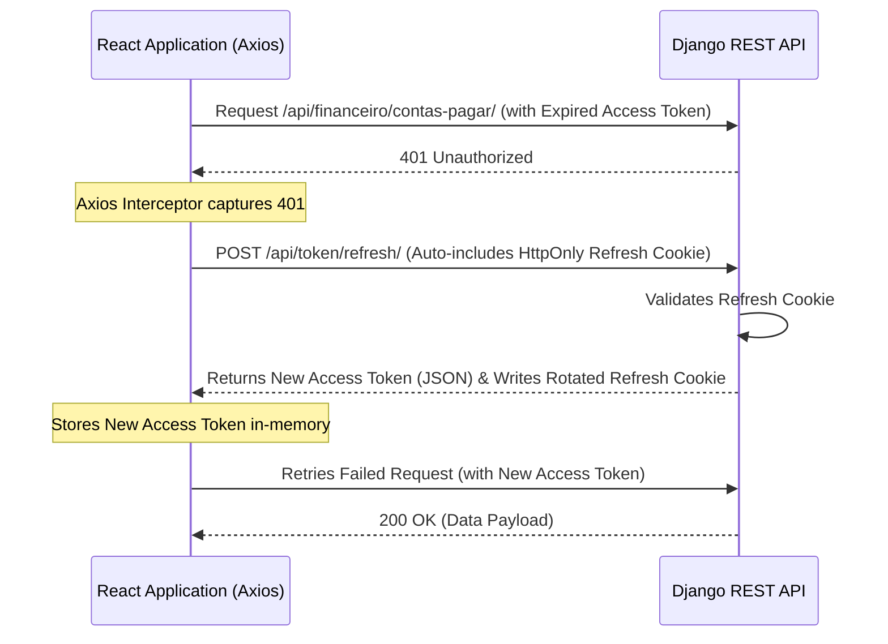

# 🔒 FreeCash Cybersecurity & Session Protocol

This document defines the strict security guidelines, authentication mechanisms, tenant isolation principles, data protection strategies, and automated security verification frameworks designed to secure the **FreeCash** SaaS application.

---

## 🔑 1. JWT Authentication with Secure HttpOnly Cookies

FreeCash implements a hybrid JWT authentication system designed to block both Cross-Site Scripting (XSS) and Cross-Site Request Forgery (CSRF) attacks.

### 🛡️ Token Segregation Model
1.  **Access Token (`access`)**:
    *   **Lifespan**: Short (e.g. 5 minutes).
    *   **Storage**: Handled strictly **in-memory** in the React application state (`_accessToken` in Axios configurations).
    *   **Security benefit**: Since it is never written to `localStorage` or `sessionStorage`, malicious XSS injection scripts cannot retrieve it.
2.  **Refresh Token (`refresh`)**:
    *   **Lifespan**: Long (e.g. 7 days).
    *   **Storage**: Stored in an encrypted browser cookie written by the Django server.
    *   **Security flags required**:
        *   `HttpOnly = True`: Inaccessible to clientside JavaScript (mitigates XSS).
        *   `Secure = True`: Only transmitted over encrypted HTTPS channels.
        *   `SameSite = Lax` (or `Strict`): Blocks automatic inclusion of cookies during cross-site requests, mitigating CSRF.
        *   `Path = /api/token/refresh/`: The cookie is only sent to the refresh endpoint, minimizing exposure.

### 🛡️ Silent Session Rotation Workflow
The frontend service layer automatically negotiates session renewals in the background using Axios interceptors. If a request returns a `401 Unauthorized` due to an expired access token:
1. The Axios interceptor intercepts the response before resolving/rejecting.
2. It makes a POST request to `/api/token/refresh/` (which automatically includes the HttpOnly secure cookie).
3. If successful, the server returns a new access token in the JSON body.
4. The interceptor updates the local in-memory token and seamlessly retries the original failed request.



---

## 🚪 2. Multi-Tenant Database Isolation

In FreeCash, user data must be completely insulated. Under no circumstances should one user be able to view, edit, or delete another user's financial entities (Horizontal Privilege Escalation).

### 🛡️ ViewSet Level Enforcement
All REST ViewSets must inherit or override `get_queryset()` to filter by `request.user` dynamically:
```python
def get_queryset(self):
    # Enforces that all retrieved objects belong to the requesting session
    return Conta.objects.filter(usuario=self.request.user)
```

### 🛡️ Deep Entity Integrity checks
When resolving related assets, cards, or categories, you must verify that the corresponding ID belongs to the requesting tenant before linking the reference.
```python
# Unsafe: resolves category purely by ID
categoria = Categoria.objects.get(id=id)

# Safe: resolves category and guarantees ownership
categoria = Categoria.objects.get(id=id, usuario=self.request.user)
```

---

## 🌐 3. Cross-Origin Resource Sharing (CORS) Rules

Since the React SPA is hosted independently from the Django REST API in production, CORS must be locked down precisely.

*   **Strict Origin Allowlist**: Never use `CORS_ALLOW_ALL_ORIGINS = True` in production. Explicitly declare authorized environments inside `settings.py`:
    ```python
    CORS_ALLOWED_ORIGINS = [
        "http://localhost:5173",
        "http://127.0.0.1:5173",
        "https://app.freecash.com", # Production Frontend Domain
    ]
    ```
*   **Credentials Flag**: To permit browsers to exchange HttpOnly cookies with the API server across domains:
    ```python
    CORS_ALLOW_CREDENTIALS = True
    ```

---

## 🧼 4. Input Sanitization & SQL Injection Prevention

*   **Django ORM Usage**: Always utilize Django's built-in Object-Relational Mapper (ORM) for model transactions. Django's ORM parameters are automatically sanitized, fully neutralizing SQL injection attempts.
*   **Avoid Raw SQL**: Never execute direct raw strings `connection.cursor().execute("SELECT ...")` containing interpolated query inputs. If raw queries are unavoidable, always pass parameters as structured arguments:
    ```python
    # Secure raw query parameterization
    cursor.execute("SELECT * FROM core_conta WHERE usuario_id = %s", [request.user.id])
    ```
*   **Django REST Validation**: Enforce maximum string lengths, correct integer ranges, and exact date pattern parsing at the Serializer level using DRF validators, preventing database type corruptions.

---

## 🧪 5. Automated Security & Multi-Tenant Testing Standards

To enforce our strict database isolation policies and prevent accidental regressions, **every** new view, serializer, or API endpoint must be accompanied by automated security tests.

### 🔹 5.1 Horizontal Privilege Escalation Tests
We maintain explicit tests in `core/tests/test_security.py` and `investimento/tests/` to guarantee user isolation.
Developers must write test cases that verify:
1.  **User A cannot read User B's resources**: A request from authenticated User A's session to retrieve a specific object belonging to User B must result in a `404 Not Found` or `403 Forbidden`.
2.  **User A cannot update or delete User B's resources**: PUT, PATCH, or DELETE requests from User A targeting a resource ID belonging to User B must return `404 Not Found` or `403 Forbidden` and leave the database unmodified.
3.  **User A cannot create resources linked to User B's entities**: When posting a new Transaction or Account, posting a foreign key ID (e.g., `categoria_id` or `cartao_id`) belonging to User B must be rejected during validation.

### 🔹 5.2 Example Security Test Pattern
```python
class SecurityTenantIsolationTests(APITestCase):
    def setUp(self):
        self.user_a = User.objects.create_user(username="usera", password="password")
        self.user_b = User.objects.create_user(username="userb", password="password")
        self.card_b = CartaoCredito.objects.create(nome="Visa B", usuario=self.user_b)

    def test_user_a_cannot_access_card_b(self):
        self.client.force_authenticate(user=self.user_a)
        url = reverse('cartaocredito-detail', kwargs={'pk': self.card_b.id})
        response = self.client.get(url)
        self.assertEqual(response.status_code, status.HTTP_404_NOT_FOUND)
```
All pull requests will run these multi-tenant tests in CI to block any potential credentials leaks.
